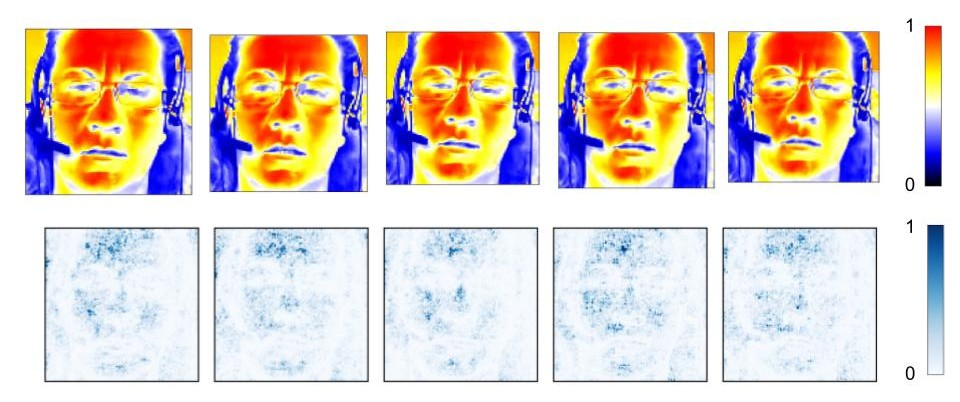
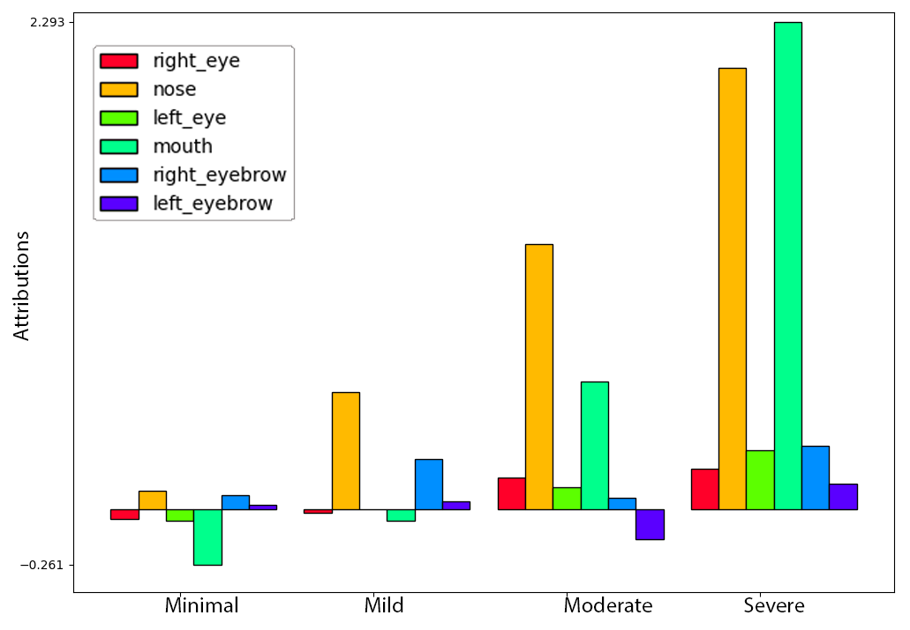
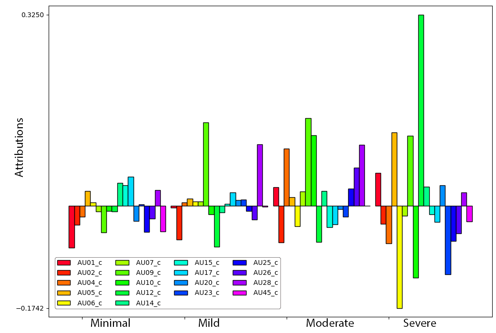

# Expresso-AI

**An explainable, video-based deep learning framework for facial-expression analysis, applied to automatic depression diagnosis.**

Expresso-AI trains deep video models (action-recognition–pretrained CNNs fine-tuned on facial videos) and then *interprets* their decisions: it produces saliency/attribution maps over facial regions and short-term temporal expression semantics, yielding both visual and quantitative explanations of what drives a model's prediction. It was developed to study automatic depression severity estimation from video while keeping the model interpretable.

This is the reference implementation for the paper below.

## Key idea

Most automated depression-detection models are black boxes that emit a score. Expresso-AI does the opposite: it makes a video model **explain itself**. By applying backpropagation-based attribution (DeepLift) to a depression-severity model and pooling the relevance *temporally*, by *facial region*, and against facial *Action Units*, the framework turns the model's decisions into **quantitative, testable hypotheses about what it learned** — not just heatmaps.

The striking result: trained only to regress depression scores from facial video — with no access to expression labels — the model independently recovered associations that match the clinical psychology literature:

- **Disgust and anger track severity.** Nose-wrinkling (AU9, disgust) was the strongest correlate of *severe* depression; brow-furrowing (AU4, anger) correlated with the *moderate* cluster.
- **Happiness is the strongest negative signal.** The Duchenne (authentic) smile — cheek-raising (AU6) + lip-corner-pulling (AU12) — was the most *negatively* correlated expression with depression at any level.
- **Expressiveness falls as severity rises.** Talkativeness and mouth expressiveness were markers of *non-severe* depression; the most depressed subjects were the least expressive.
- **Eye-region** attributions grew with severity, consistent with reduced eye contact and gaze aversion.

That a model supervised only on a depression score reconstructs known affective markers — and that the framework can generate such hypotheses from *any* video model — is what makes the approach distinctive. (The paper frames these as hypotheses for subsequent statistical validation.)

## Citation

> F. Moreno, S. Alghowinem, H. W. Park, and C. Breazeal, "Expresso-AI: An Explainable Video-Based Deep Learning Models for Depression Diagnosis," *2023 11th International Conference on Affective Computing and Intelligent Interaction (ACII)*, IEEE, 2023, pp. 1–8. doi: [10.1109/ACII59096.2023.10388143](https://doi.org/10.1109/ACII59096.2023.10388143)

<!-- arXiv: link to be added once the preprint is posted -->

```bibtex
@inproceedings{moreno2023expressoai,
  title     = {Expresso-AI: An Explainable Video-Based Deep Learning Models for Depression Diagnosis},
  author    = {Moreno, Felipe and Alghowinem, Sharifa and Park, Hae Won and Breazeal, Cynthia},
  booktitle = {2023 11th International Conference on Affective Computing and Intelligent Interaction (ACII)},
  pages     = {1--8},
  year      = {2023},
  publisher = {IEEE},
  doi       = {10.1109/ACII59096.2023.10388143}
}
```

## Example explanations

Expresso-AI produces both qualitative and quantitative explanations of a video model's depression-severity predictions.

**Top attribution frames** — the frames and facial regions the model relied on most for a correctly-estimated subject:



**Region-wise attribution clusters** — which facial regions drive predictions, aggregated across correctly-predicted samples:



**Action-unit cross-correlation clusters** — relating attributions to facial action units (FACS) on correctly-predicted samples:



_Figures from the paper (ACII 2023)._

## Repository layout

```
expresso_ai/
  data/        Dataset + dataloaders (FaceDataset)
  facial/      Facial landmark and action-unit utilities
  models/      Video/image backbones (facenet variants, r3d_18, r2plus1d_18, r3d, densenet, resnext, ...)
  interpret/   ModelInterpreter + region-wise and action-unit attribution analysis
  metrics/     Regression metrics (clustered MAE/MSE/RMSE)
  optim/       Layer freezing / fine-tuning utilities
  utils/       Metadata generation, video helpers, visualization
scripts/       Dataset prep, processing, training/testing/interpreting entry points
```

## Installation

Requires Python 3.6+, CUDA, and `ffmpeg` (plus `libavdevice-dev` for torchvision video models).

```bash
pip install --upgrade pip
pip install -r requirements.txt
# for the 3D-CNN video models:
pip install -r requirements_latest.txt
pip install -e .
```

## Data

The clinical depression dataset used in the paper is **not** distributed with this repository. Provide your own data in the layout below; `*_dataset/labels.csv` maps each sample to an id and a label (see the small synthetic examples in `regression_dataset/labels.csv` and `classifier_dataset/labels.csv`).

```
data/
  id_0/original.avi
  id_1/original.avi
  ...
```

### Preparing and processing data

```bash
# 1. standardize the file structure and build labels.csv
python scripts/prepare_dataset.py --input_path=./original_dataset --output_path=./prepared_dataset

# 2. extract face / eye ROIs at the model input size
python scripts/process_dataset.py --data_path=./prepared_dataset --input_width=112 --output_width=112

# 3. (optional) extract facial action units via the OpenFace Docker image
docker run -it --rm algebr/openface:latest
python scripts/extract_action_units.py --data_path=./data_path
```

### Environment configuration

```bash
cp environment_config_example.py environment_config.py   # then edit for your GPU/memory/cores
```

## Training, testing, and interpreting

The main entry point is `scripts/face_main.py`. Routines can be combined (`--train --test --interpret`).

```bash
# train a video model
python scripts/face_main.py --train --model_name=r2plus1d_18 --data_path=./regression_dataset/ \
    --window_size=300 --overlap=0.5 --epochs=50 --lr=1e-4

# test
python scripts/face_main.py --test --model_name=r2plus1d_18 --load_best=True

# interpret: compute attributions and render explanations
python scripts/face_main.py --interpret --compute_attributions=True \
    --interpretation_algorithm=DeepLift --generate_video_visualizations=True
```

Supported interpretation algorithms (via [Captum](https://captum.ai/)): `Saliency`, `IntegratedGradients`, `NoiseTunnel`, `DeepLift`. Attributions are written to `attributions/` and rendered explanations to the interpretation output directory.

## License

Released under the MIT License — see [LICENSE](LICENSE).
